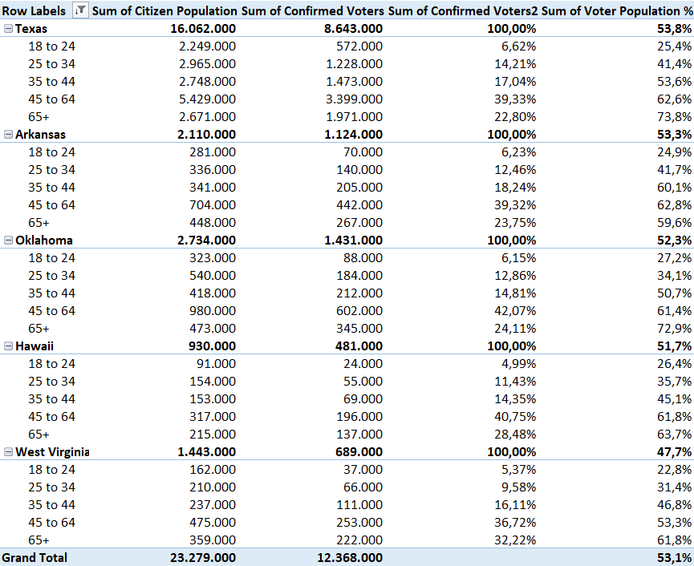
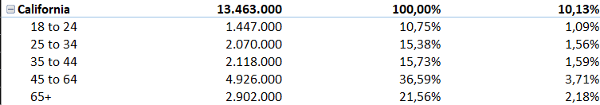
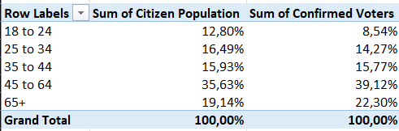
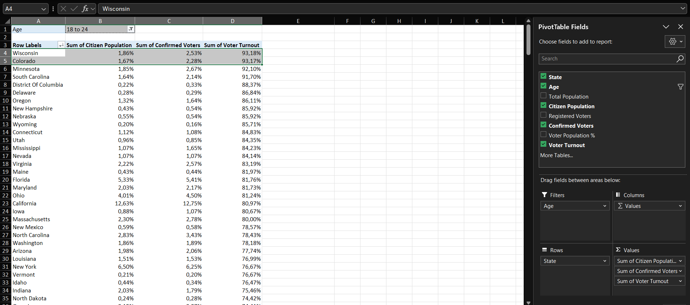
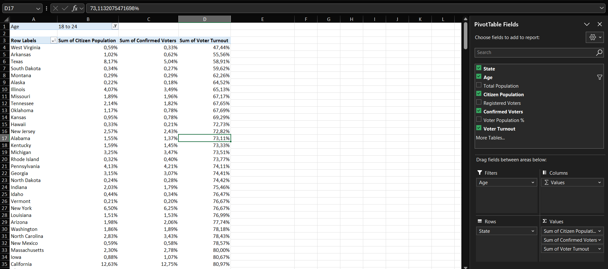

# Case 1 — U.S. Voter Demographics

**Dataset:** 255 rows · 2012 general election · state by age bracket
**Sheet:** `Voter Pivot`

## Q1. How many states had a Voter Population % below 55%? Which ones?

Five. The field is Confirmed Voters divided by Citizen Population.

| State | Voter Population % |
|---|---|
| West Virginia | 47.75% |
| Hawaii | 51.72% |
| Oklahoma | 52.34% |
| Arkansas | 53.27% |
| Texas | 53.81% |

## Q2. How many confirmed voters in California were over 65 in 2012? What percentage of California's total? And of the country's?

2,902,000 voters aged 65 and over. That is 21.56% of California's 13,463,000 confirmed voters and 2.18% of the 132,952,000 nationwide.

## Q3. Showing Citizen Population and Confirmed Voters by age as % of Column Total, what percentage do 45-to-64-year-olds represent in each?

35.63% of the citizen population and 39.12% of confirmed voters, so the bracket votes above its size. The 18-to-24 bracket does the opposite: 12.80% of citizens and 8.54% of voters.

## Q4. Using the calculated field Voter Turnout, which state had the highest turnout rate? And among 18-to-24-year-old voters?

Colorado, at 94.69%. Among 18-to-24-year-olds it is Wisconsin, at 93.18%, with Colorado second at 93.17%.

## Q5. As a politician seeking to improve turnout among young adults, which states would you target first?

The four states below 60% turnout in that age bracket: West Virginia (47.44%), Arkansas (55.56%), Texas (58.91%) and South Dakota (59.62%). West Virginia comes first, more than 8 points below the next state.

---

[← All cases](../README.md)
