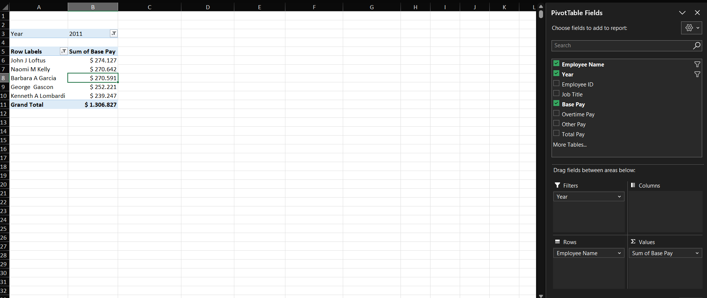
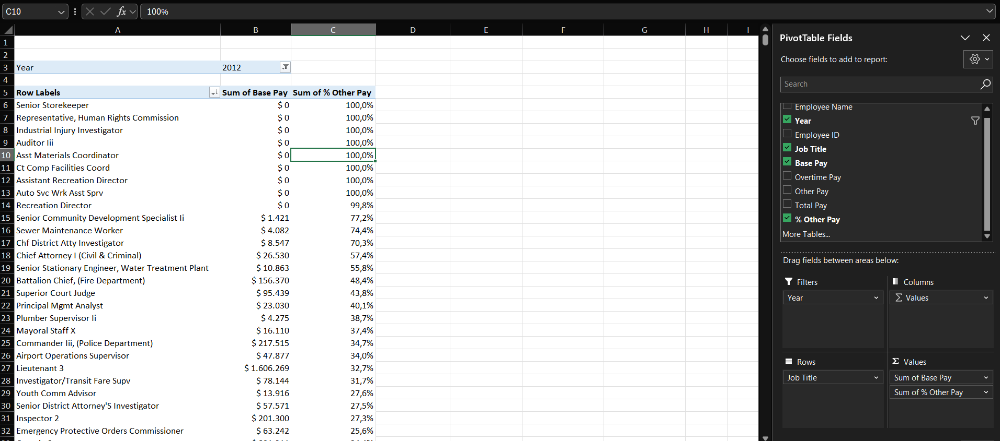
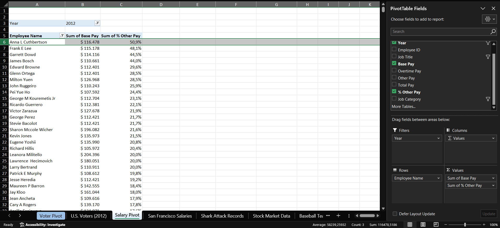
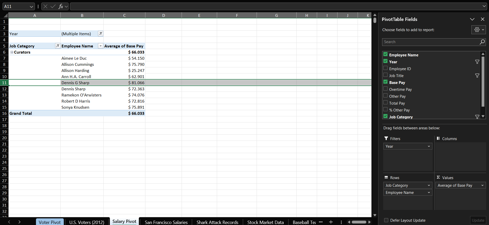

# Case 2 — San Francisco Salaries

**Dataset:** 24,285 rows · 2011-2013 · city payroll
**Sheet:** `Salary Pivot`

## Q1. Which five employees earned the highest Base Pay in 2011?

| Employee | Job Title | Base Pay |
|---|---|---|
| John J Loftus | Deputy Chief 3 | $274,126.50 |
| Naomi M Kelly | Dept Head V | $270,641.50 |
| Barbara A Garcia | Dept Head V | $270,591.04 |
| George Gascon | District Attorney | $252,221.06 |
| Kenneth A Lombardi | Assistant Deputy Chief 2 | $239,247.00 |

## Q2. Using the calculated field % Other Pay, how many job titles earned only Other Pay in 2012?

Eight. They recorded zero Base Pay and zero Overtime Pay, with a non-zero Other Pay: Assistant Recreation Director, Asst Materials Coordinator, Auditor III, Auto Svc Wrk Asst Sprv, Ct Comp Facilities Coord, Industrial Injury Investigator, Representative Human Rights Commission and Senior Storekeeper.

## Q3. Among employees with $100k or more in Base Pay in 2012, did anyone earn more than 50% of their pay from Other Pay?

One: Anna L Cuthbertson, at 50.9%. She received $124,034.01 in Other Pay against $116,478.01 in Base Pay. The next two are below the threshold, at 48.1% and 44.5%.

## Q4. Grouping every title containing "Curator", how many employees held a Curator position in 2012 or 2013, and who earned the highest average base pay?

Nine employees. The highest average base pay was Dennis G Sharp, at $81,065.54.

---

[← All cases](../README.md)
