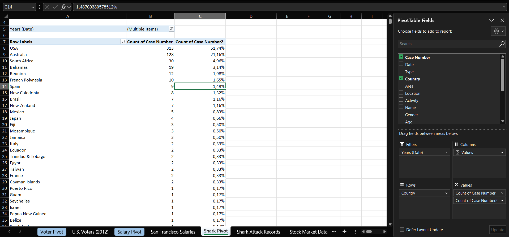
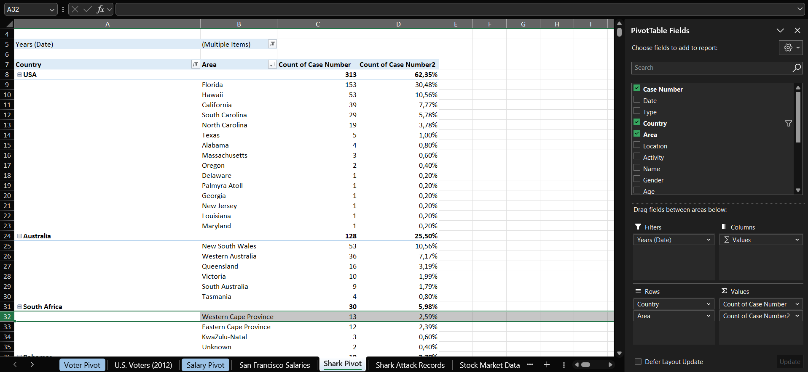
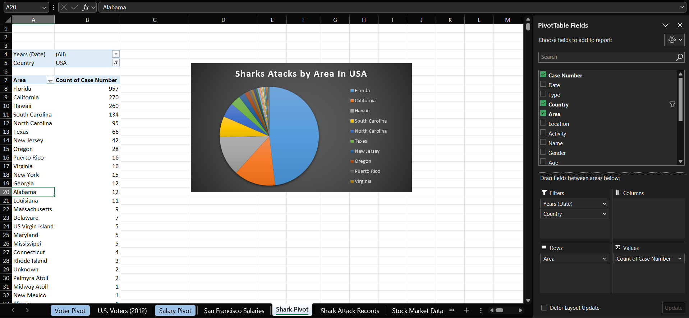
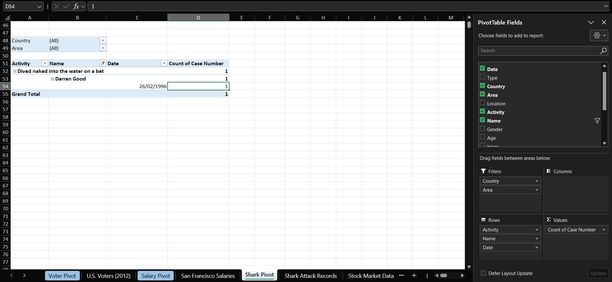

# Case 3 — Shark Attack Records

**Dataset:** 5,292 rows · 1900-2016, of which 605 fall in 2012-2016
**Sheet:** `Shark Pivot`

## Q1. Which three countries reported the most attacks between 2012 and 2016? What percentage occurred in Spain?

The USA with 313, Australia with 128 and South Africa with 30. The USA alone is just over half of all reported attacks in the period. Spain recorded 9 attacks, or 1.49%.

## Q2. With the report in Outline layout and the top 5 areas by country, where in South Africa were attacks most frequently reported?

Western Cape Province, with 13 cases, just ahead of Eastern Cape Province with 12. Between the two they account for 25 of South Africa's 30 attacks.

## Q3. Showing Count of Case Number as % of Parent Total by country, what percentage of attacks in New Zealand were unprovoked? How many cases?

6 of 7 cases, which is 85.71%.

## Q4. Filtering for the USA, chart the count of attacks by Area.

Florida accounts for 957 of the 1,989 cases, followed by California with 270 and Hawaii with 260. The tail is long: 15 areas report a single case, which is why the chart shows a top-10 cut as horizontal bars instead of a pie.

## Q5. Removing the date filter, what was Darren Good doing when he was attacked? When did it happen?

He had dived naked into the water on a bet, in Australia, on 26 February 1996.

---

[← All cases](../README.md)
