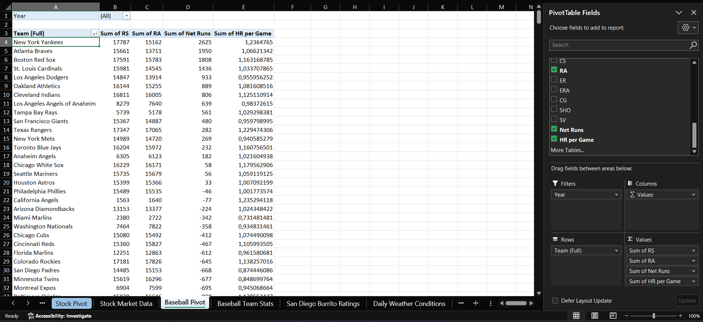
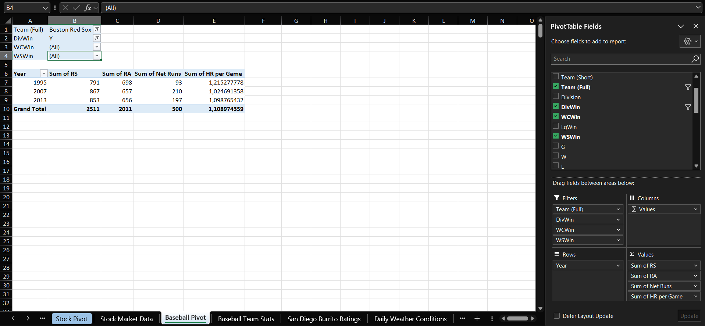
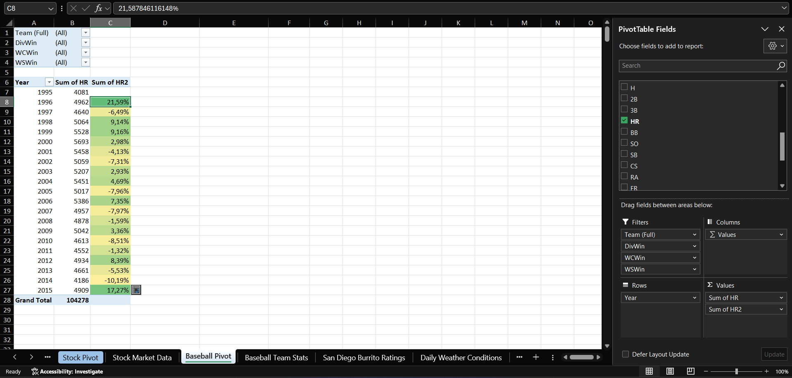
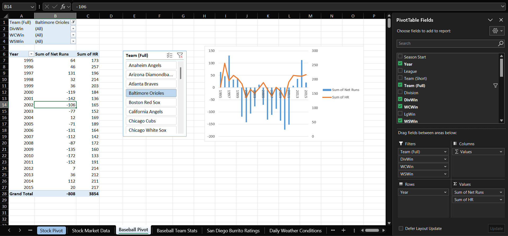

# Case 5 — Major League Baseball

**Dataset:** 624 rows · 1995-2015 seasons · team statistics
**Sheet:** `Baseball Pivot`

## Q1. Using the calculated fields Net Runs (RS - RA) and HR per Game (HR / G), which team had the highest Net Runs over the whole sample? And in 2015 alone?

Over the whole sample, the New York Yankees with +2,625, ahead of the Atlanta Braves with +1,950. In 2015, the Toronto Blue Jays with +221, ahead of St. Louis with +122.

## Q2. For the Red Sox by year, which seasons did they win the Division, the Wild Card and the World Series?

| | Seasons |
|---|---|
| Division | 1995, 2007, 2013 |
| Wild Card | 1998, 1999, 2003, 2004, 2005, 2008, 2009 |
| World Series | 2004, 2007, 2013 |

## Q3. Showing league-wide home runs by year with a second instance as % Difference From the previous year, which season saw the largest decline?

2014, at -10.19%, going from 4,661 to 4,186. The drop reversed at once: 2015 reached 4,909, the highest total in the sample.

## Q4. With a team slicer set to the Baltimore Orioles and a combo chart, do Net Runs and HR per Game follow a similar trend?

Yes. The two move together across the whole period, including the trough around 2010-2011 and the recovery from 2012 onward. Over the full sample the Orioles are at -808 net runs.

---

[← All cases](../README.md)
