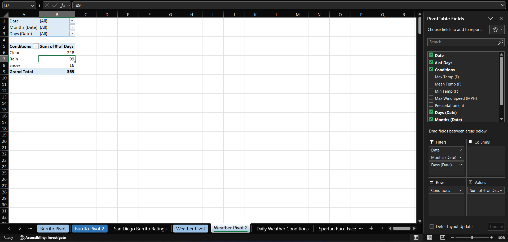
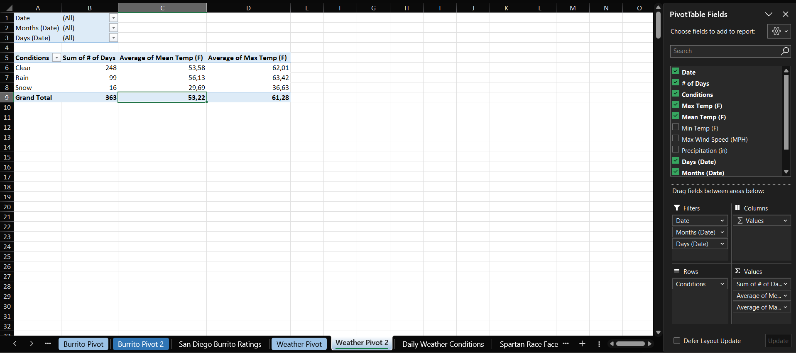
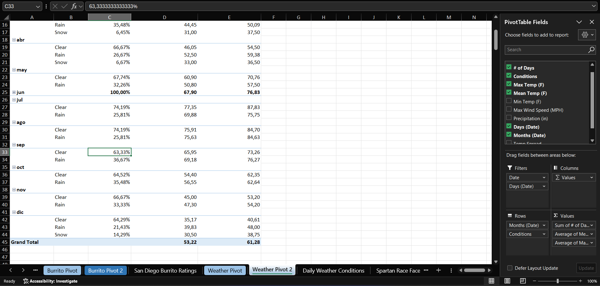
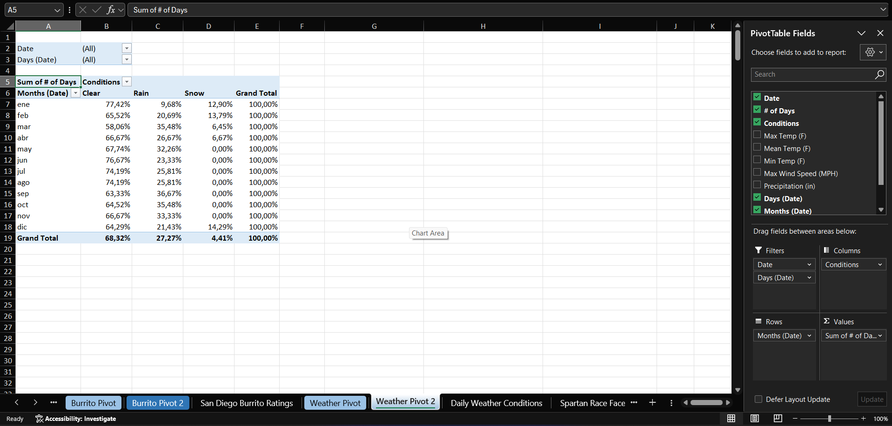
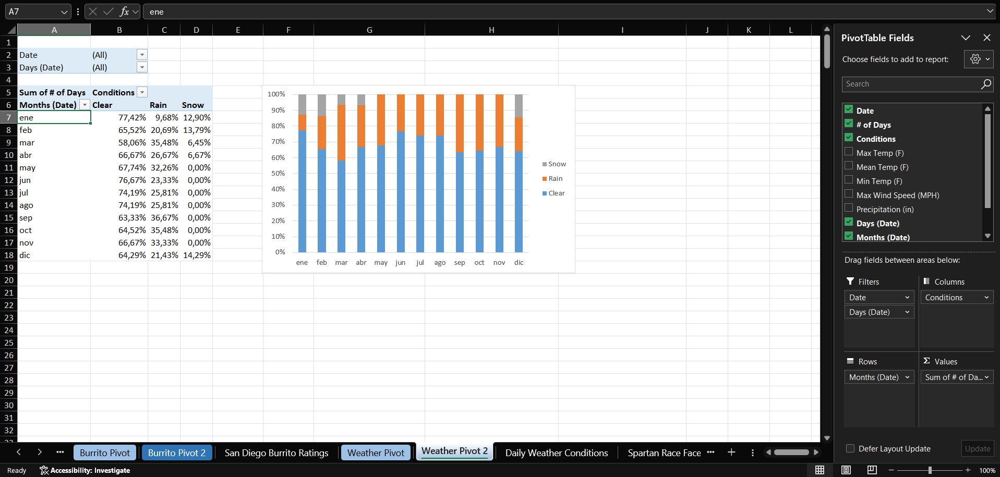

# Case 7 — Daily Weather Conditions

**Dataset:** 363 rows · 1 January to 28 December 2016
**Sheets:** `Weather Pivot` · `Weather Pivot 2`

> The dataset covers 363 of the 366 days in 2016. The last three days of December are missing, so every percentage below is computed on the days present.

## Q1. How many days in 2016 were Clear, Rain and Snow?

248 Clear, 99 Rain and 16 Snow.

## Q2. What was the average temperature on clear days versus snowy days? And the average maximum?

| Conditions | Mean Temp | Max Temp |
|---|---|---|
| Clear | 53.58 °F | 62.01 °F |
| Rain | 56.13 °F | 63.42 °F |
| Snow | 29.69 °F | 36.62 °F |

Rainy days average 2.5 °F warmer than clear ones. Cloud cover holds heat overnight, so the result is not a data error, but it is worth stating before someone reads "clear day" as "warm day".

## Q3. Showing # of Days by month and condition as a percentage of the month, what percentage of September days were clear?

63.33%.

## Q4. With Conditions on the columns and values as % of Row Total, how often did it snow in January?

12.90% of the month, which is 4 days.

## Q5. Removing grand totals and charting as a 100% stacked column, in how many months of 2016 did it not snow at all?

Seven, from May through November. Snow appears only in January, February, March, April and December.

---

[← All cases](../README.md)
