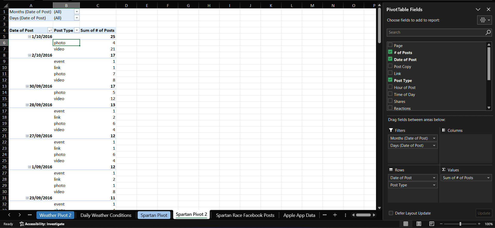
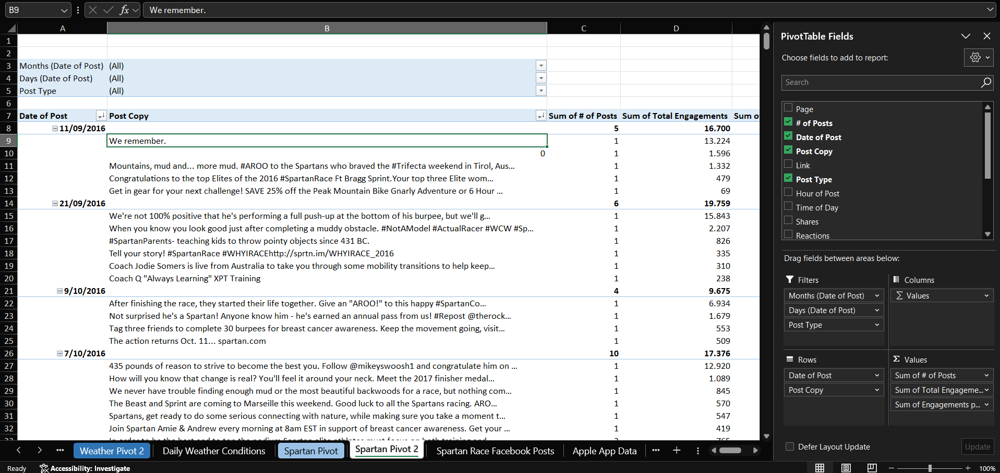
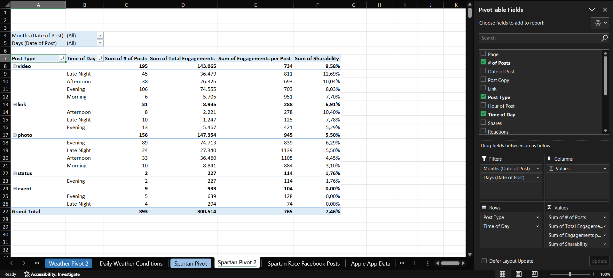
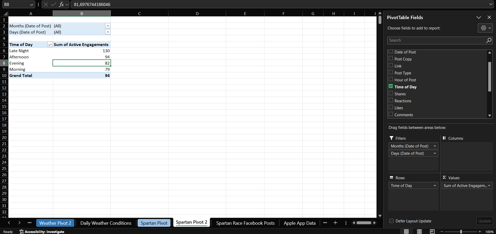

# Case 8 — Spartan Race Facebook Posts

**Dataset:** 393 rows · 30 August to 15 October 2016
**Sheets:** `Spartan Pivot` · `Spartan Pivot 2`

## Q1. On which date did Spartan Race post most often? What types of posts were they?

1 October 2016, with 25 posts: 21 videos and 4 photos.

## Q2. Which date showed the highest total engagement volume? The highest engagements per post? On that date, which post drove the strongest response?

The highest total engagement volume was on 21 September 2016, with 19,759 engagements across 6 posts. The highest per post was 11 September 2016, at 3,340 across 5 posts. The post that drove the strongest response that day was "We remember.", with 13,224 engagements. On 1 October there were 25 posts, four times as many, and less total engagement.

## Q3. Using the calculated field Sharability (Shares / Total Engagements), which post types are most sharable? What time of day do people share most?

Videos, at 9.58%, ahead of links at 6.91% and photos at 5.50%. By time of day it is Late Night, at 9.53%, against 4.90% in the morning.

## Q4. Using Active Engagements per post ((Shares + Comments) / # of Posts), what time of day are users least likely to actively engage?

The morning, at 78.5 active engagements per post, against 129.96 in Late Night. Only 16 of the 393 posts were published in the morning, so that figure rests on a much thinner base than the 215 evening posts.

---

[← All cases](../README.md)
