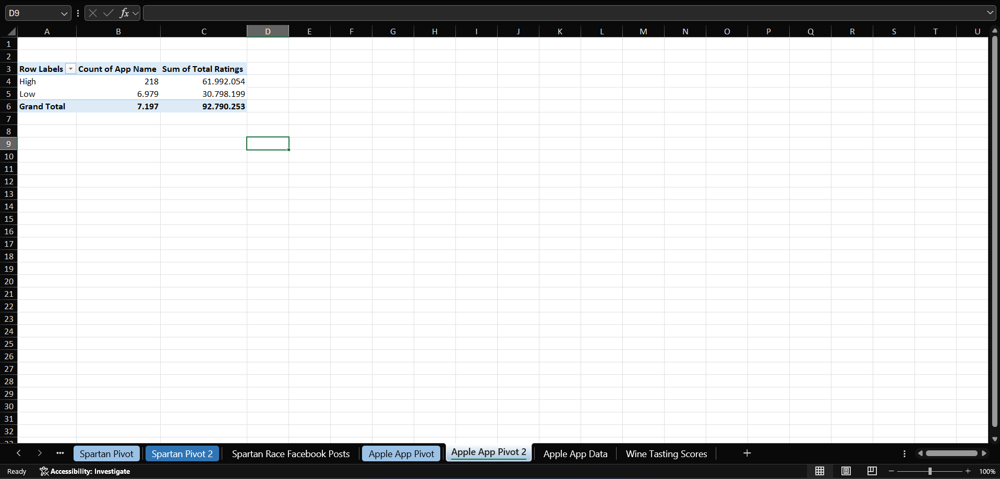
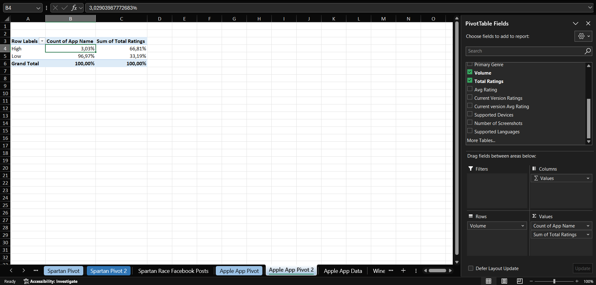
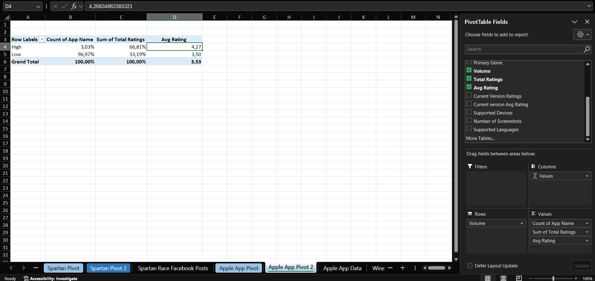
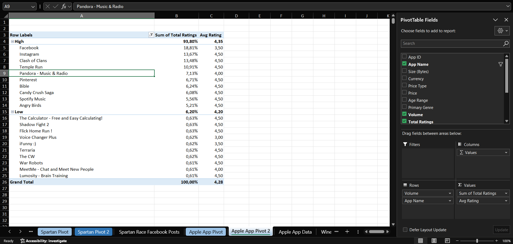
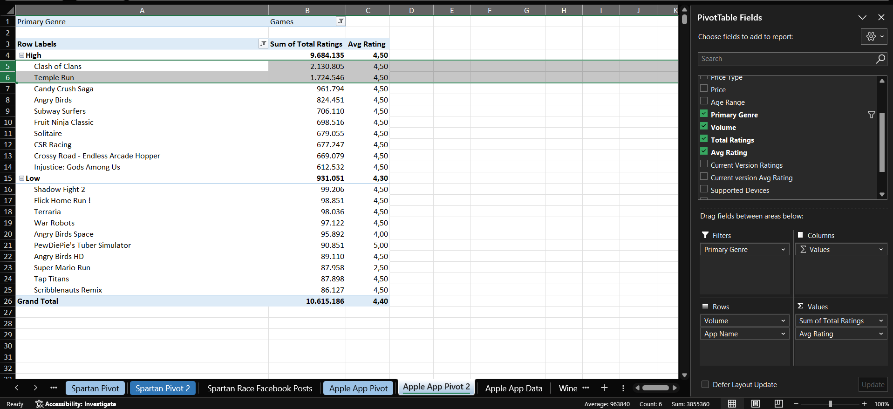
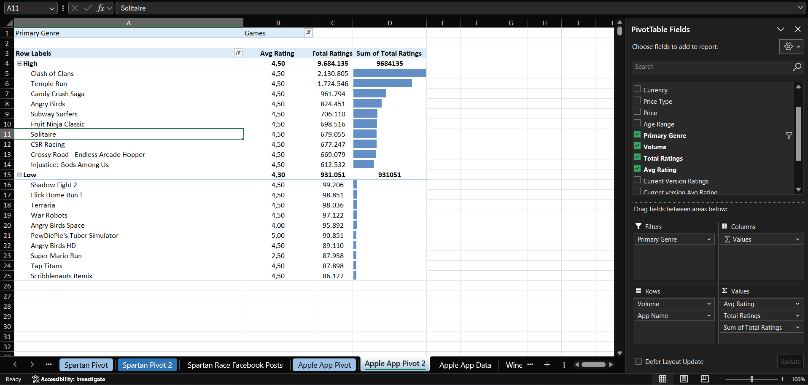
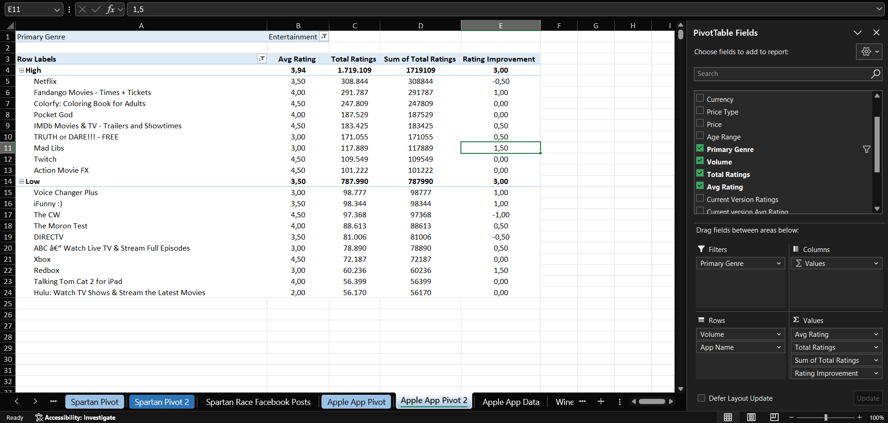
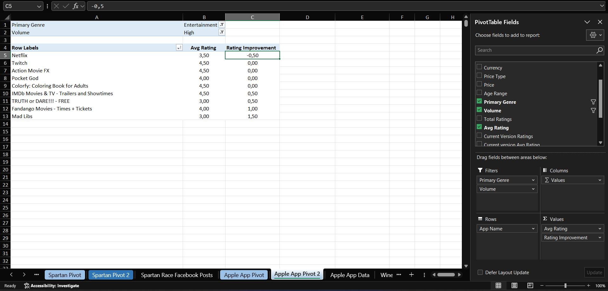

# Case 9 — Apple App Store Data

**Dataset:** 7,197 rows · app metadata and ratings
**Sheets:** `Apple App Pivot` · `Apple App Pivot 2`

Three helper columns were added to the source data:

```excel
Price Type         =IF(Price = 0, "Free", "Paid")
Volume             =IF(Total Ratings > 100000, "High", "Low")
Rating Improvement =Current Version Avg Rating - Avg Rating
```

## Q1. How many apps are high-volume? What percentage of apps and of total ratings do they represent? How do average ratings compare?

218 apps are high-volume.



They are 3.03% of the catalogue but hold 66.81% of all ratings.



High-volume apps average 4.27 stars against 3.50 for low-volume ones. A 3% slice of the catalogue carries two thirds of the ratings and rates almost eight tenths of a star higher.



## Q2. Among high-volume apps, which three drove the most ratings? Which Games apps passed one million ratings?

Facebook with 2,974,676, Instagram with 2,161,558 and Clash of Clans with 2,130,805.



Within the Games genre two apps clear one million: Clash of Clans with 2,130,805 and Temple Run with 1,724,546. The next one down, Candy Crush Saga, falls short at 961,794.



The same view with a second instance of Total Ratings as data bars.



## Q3. Among high-volume Entertainment apps, which saw the largest rating improvement with the current version? Did any decline?

Mad Libs had the largest improvement, from 3.0 to 4.5, which is +1.5.



Netflix was the only one that declined, from 3.5 to 3.0. Five of the nine apps in this group did not change at all.



---

[← All cases](../README.md)
