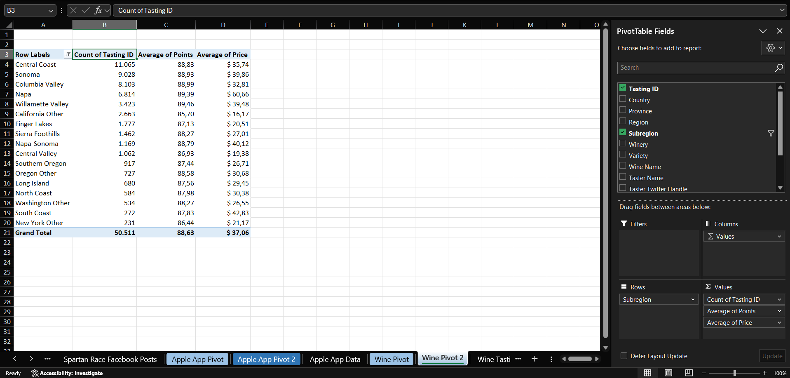
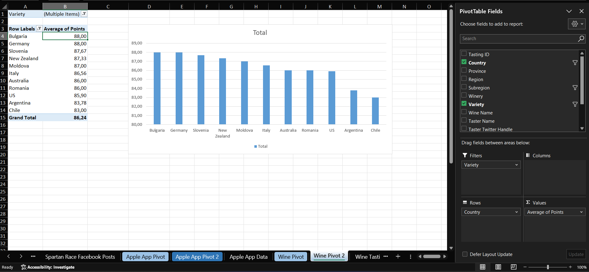
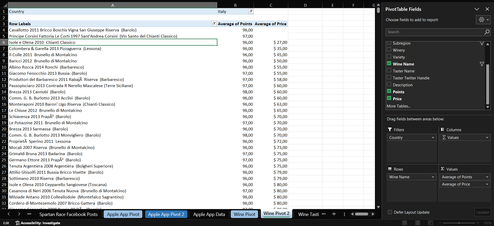
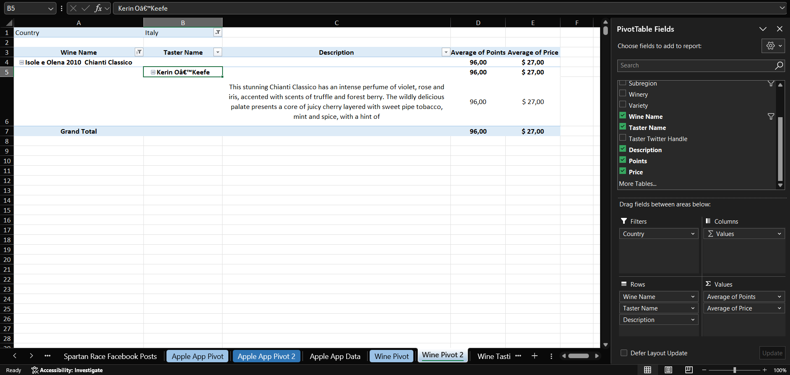

# Case 10 — Wine Tasting Scores

**Dataset:** 129,971 rows · tasting notes, scores and prices
**Sheets:** `Wine Pivot` · `Wine Pivot 2`

## Q1. By subregion: which produced the highest-rated wines on average? The highest-priced? Which has the most tastings recorded, excluding blanks?

Willamette Valley has the highest average score at 89.46, with Napa close behind at 89.39. Napa has the highest average price at $60.66, well ahead of South Coast at $42.83. Central Coast has the most tastings, with 11,065.

## Q2. Which country generated the highest average ratings? The lowest? How do Pinot Grigio varieties compare across countries?

England has the highest average rating, 91.58, and Peru the lowest, 83.56. The samples behind them are small, and the same table returns India at 90.22 from 9 tastings and Egypt from a single one. For Pinot Grigio, Bulgaria and Germany tie at 88.00, but from 1 and 3 tastings. Italy averages 86.56 across 605 tastings, so it is the only country with enough data to compare.

## Q3. What is the cheapest Italian wine rated over 95 points? Who reviewed it and how did they describe it?

Isole e Olena 2010 Chianti Classico, at 96 points and $27.00. 131 Italian wines score above 95 and this is the cheapest with a price on record; the next is $35. Two wines appear above it in the view, Principe Corsini (97 points) and Cavallotto (96 points), because they are the only two in the group with no price recorded.

The reviewer is Kerin O'Keefe. She describes a floral nose of violet, rose and iris with truffle and forest berry, a palate of juicy cherry with sweet pipe tobacco, mint and spice, and vibrant acidity with refined tannins, and suggests drinking it between 2016 and 2025.

---

[← All cases](../README.md)
